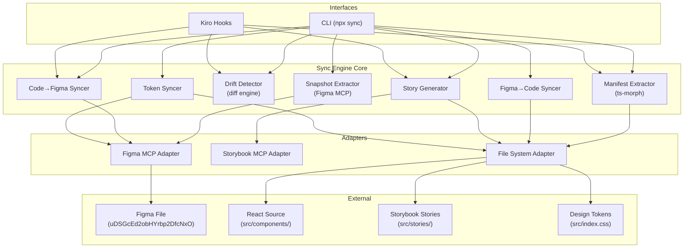
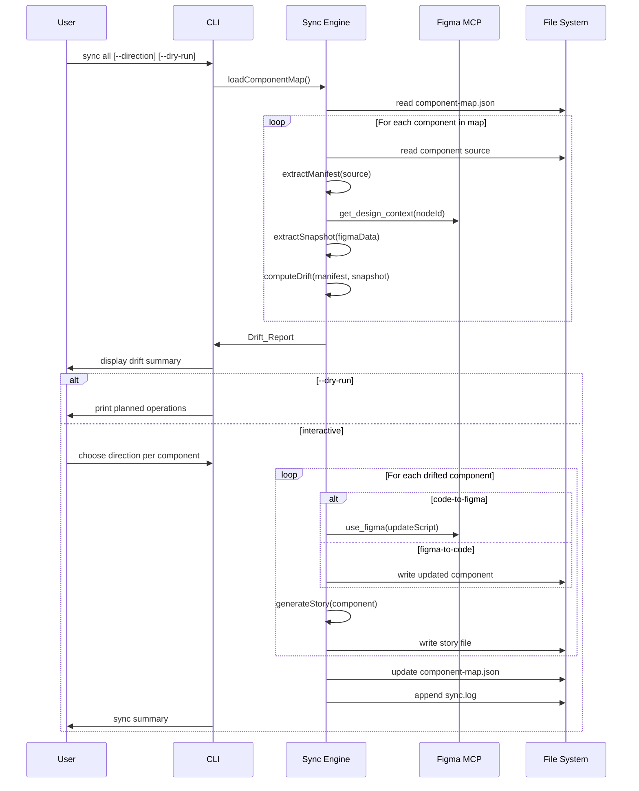
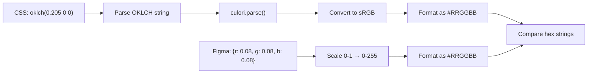

# Design Document: Bidirectional Sync Tooling

## Overview

This design describes the architecture and implementation of bidirectional synchronization tooling between the React codebase and the Figma design system. The tooling automates three workflows that are currently manual: detecting drift between code and Figma, syncing changes in either direction, and generating Storybook stories with interaction tests when components change.

The system is built as a **Sync_Engine** module that both a CLI interface and Kiro hooks consume. The engine coordinates four core operations: extracting a Component_Manifest from React source code, extracting a Figma_Snapshot via MCP tools, computing a Drift_Report by comparing the two, and dispatching sync operations in the chosen direction.

### Key Constraints

- **20KB output limit** per `use_figma` call — sync operations that modify Figma must be chunked
- **No Code Connect** — Org/Enterprise plan not available; component descriptions serve as metadata
- **OKLCH ↔ RGB color mismatch** — CSS tokens use OKLCH color space, Figma variables store RGB; normalization required for comparison
- **Figma MCP is the only Figma interface** — all reads/writes go through MCP tools, not the REST API
- **Storybook MCP availability is optional** — template-based fallback required when disconnected

### Design Decisions

1. **ts-morph for AST parsing** — The TypeScript Compiler API wrapper provides reliable extraction of `cva` variant objects, prop type definitions, and Tailwind class strings. Regex/pattern matching is fragile for nested object literals and template strings. ts-morph handles the full TypeScript grammar and is the standard choice for programmatic TS analysis.

2. **culori for color normalization** — The `culori` library supports OKLCH → sRGB → hex conversion natively. CSS tokens are parsed from OKLCH strings, Figma variables are read as RGB, and both are normalized to 6-digit hex for comparison. This avoids floating-point drift in OKLCH comparisons.

3. **Token-name-first comparison** — When a Figma color is bound to a variable, comparison uses the token name (e.g., `primary`) rather than the resolved color value. Hex comparison is only used for hardcoded colors or when token names don't match.

4. **Single CLI entry point with subcommands** — `npx sync <subcommand>` pattern using a lightweight argument parser (no heavy CLI framework). Subcommands: `init`, `drift`, `push`, `pull`, `stories`, `all`.

5. **Sync_Engine as a shared module** — Both CLI commands and Kiro hook agent prompts call the same engine functions. The engine is a set of pure-ish functions (manifest extraction, snapshot extraction, diff computation) plus side-effecting functions (Figma MCP calls, file writes) that are injected as dependencies.

6. **Component_Map as the source of truth for linkage** — The JSON registry at `.kiro/sync/component-map.json` is the single place that associates code files with Figma nodes. All operations read from and write to this file.

7. **Vitest + fast-check for property-based testing** — The project doesn't currently have a test runner, but Vitest is the natural choice for a Vite project. `fast-check` is the standard PBT library for TypeScript and integrates cleanly with Vitest.

## Architecture

The system follows a layered architecture where the Sync_Engine core is consumed by two interfaces (CLI and Kiro hooks), and delegates external operations to adapters.



### Orchestrator Workflow

The `sync all` command executes the full pipeline:



## Components and Interfaces

### Manifest Extractor

Parses React component files using ts-morph to produce a Component_Manifest.

```typescript
// src/sync/manifest-extractor.ts

interface ManifestExtractor {
  extract(filePath: string): ComponentManifest;
}
```

**Extraction strategy:**

1. Create a ts-morph `Project` with the project's `tsconfig.json`
2. For each component file, find the `cva()` call expression
3. Extract the `variants` object literal — each key is a variant name, each value's keys are the options
4. Find the component function's props parameter type to extract prop names and types
5. Scan all string literals and template expressions for Tailwind class references to design tokens (e.g., `bg-primary`, `text-muted-foreground`)
6. Extract spacing classes (`gap-*`, `p-*`, `px-*`, `py-*`) and radius classes (`rounded-*`)

**cva extraction example** for `button.tsx`:

```typescript
// ts-morph finds this call:
const buttonVariants = cva("...", {
  variants: {
    variant: { default: "...", outline: "...", ... },
    size: { default: "...", xs: "...", ... }
  },
  defaultVariants: { variant: "default", size: "default" }
});

// Produces:
{
  variants: {
    variant: ["default", "outline", "secondary", "ghost", "destructive", "link"],
    size: ["default", "xs", "sm", "lg", "icon", "icon-xs", "icon-sm", "icon-lg"]
  },
  defaultVariants: { variant: "default", size: "default" }
}
```

**Tailwind token extraction** uses a regex scan over all class strings to find token-referencing utilities:

```typescript
const TOKEN_PATTERN = /(?:bg|text|border|ring|fill|stroke)-(\w[\w-]*(?:\/\d+)?)/g;
// Matches: bg-primary, text-muted-foreground, border-input, ring-ring/50
```

### Snapshot Extractor

Calls Figma MCP tools to produce a Figma_Snapshot for a component.

```typescript
// src/sync/snapshot-extractor.ts

interface SnapshotExtractor {
  extract(figmaNodeId: string): Promise<FigmaSnapshot>;
}
```

**Extraction strategy:**

1. Call `get_design_context` with the node ID
2. Parse the response to extract variant properties, color bindings, layout values
3. For color bindings: if bound to a variable, record the token name; if hardcoded, record the hex value
4. Call `get_variable_defs` to get the full variable collection for token name resolution
5. If `get_design_context` response is truncated (>20KB), fall back to `get_metadata` first, then re-fetch specific sub-nodes

### Drift Detector

Compares a Component_Manifest against a Figma_Snapshot to produce a Drift_Report.

```typescript
// src/sync/drift-detector.ts

interface DriftDetector {
  compare(manifest: ComponentManifest, snapshot: FigmaSnapshot): DriftReport;
  compareAll(map: ComponentMap): Promise<DriftReport>;
}
```

**Comparison rules:**

| Property | Code Source | Figma Source | Match Criteria |
|----------|-----------|-------------|----------------|
| Variants | `cva` variants object | Component set variant properties | Same variant names and option values |
| Colors | Tailwind token classes | Variable bindings or hex fills | Token name equality, or hex equality after OKLCH→hex conversion |
| Spacing | Tailwind gap/padding classes | Auto-layout itemSpacing/padding | Value equality using Tailwind→px map |
| Radius | Tailwind rounded-* classes | cornerRadius value | Value equality using Tailwind→px map |
| Props | TypeScript prop types | Figma variant properties | Prop names present in both |

### Code-to-Figma Syncer

Generates `use_figma` JavaScript to update Figma components based on drift.

```typescript
// src/sync/code-to-figma.ts

interface CodeToFigmaSyncer {
  sync(component: string, drift: DriftEntry): Promise<SyncResult>;
}
```

**Chunking strategy** for the 20KB limit:
- Each `use_figma` call handles one type of change (variants, colors, spacing, or radius)
- Variant additions are batched: up to 5 new variants per call
- The syncer estimates output size and splits if the operation would exceed ~15KB (leaving margin)

### Figma-to-Code Syncer

Modifies React source files based on Figma changes.

```typescript
// src/sync/figma-to-code.ts

interface FigmaToCodeSyncer {
  sync(component: string, drift: DriftEntry): Promise<SyncResult>;
}
```

**Code modification strategy:**
- Uses ts-morph to modify the AST directly (not string replacement)
- For variant changes: modifies the `cva` variants object literal
- For color changes: finds and replaces Tailwind class strings
- For spacing changes: finds and replaces Tailwind spacing classes
- Writes the modified file back using ts-morph's `saveSync()`

### Token Syncer

Handles design token synchronization between `src/index.css` and Figma variables.

```typescript
// src/sync/token-syncer.ts

interface TokenSyncer {
  extractCSSTokens(cssPath: string): DesignToken[];
  extractFigmaTokens(): Promise<DesignToken[]>;
  compareTokens(cssTokens: DesignToken[], figmaTokens: DesignToken[]): TokenDriftReport;
  syncTokenToFigma(token: DesignToken): Promise<void>;
  syncTokenToCSS(token: DesignToken, cssPath: string): void;
}
```

**Color normalization pipeline:**



CSS OKLCH values are parsed using `culori`, converted to sRGB, then formatted as 6-digit hex. Figma RGB values (0-1 float range) are scaled to 0-255 integers and formatted as hex. Comparison uses case-insensitive hex string equality.

### Story Generator

Produces Storybook story files with interaction tests.

```typescript
// src/sync/story-generator.ts

interface StoryGenerator {
  generate(manifest: ComponentManifest, options: StoryGenOptions): string;
  merge(existingStory: string, newStories: string): string;
}
```

**Generation strategy:**

1. **Storybook MCP path** (preferred): Pass the component file path, manifest JSON, and project conventions to the Storybook MCP. The MCP generates stories following the project's patterns.

2. **Template fallback**: When Storybook MCP is unavailable, use a template engine that:
   - Creates a `Meta` object with `title` (based on atomic design level), `component`, `parameters`, `tags: ["autodocs"]`, and `argTypes` from the manifest's variants
   - Generates one story per variant option with a `play` function that verifies visibility and basic interaction
   - Uses `expect`, `within`, `userEvent`, `fn` from `storybook/test`

**Merge strategy** for existing stories:
- Parse the existing story file to find exported story names
- Only add stories for new variants that don't have existing stories
- Preserve all manually written stories (identified by not matching the auto-generated naming pattern)

### Figma MCP Adapter

Wraps Figma MCP tool calls with error handling, retry logic, and output size management.

```typescript
// src/sync/adapters/figma-mcp.ts

interface FigmaMCPAdapter {
  getDesignContext(nodeId: string): Promise<FigmaDesignContext>;
  getMetadata(nodeId: string): Promise<FigmaMetadata>;
  getScreenshot(nodeId: string): Promise<string>;
  getVariableDefs(): Promise<FigmaVariableCollection>;
  searchDesignSystem(query: string): Promise<FigmaSearchResult[]>;
  useFigma(script: string): Promise<UseFigmaResult>;
}
```

### CLI Interface

Single entry point at `src/sync/cli.ts`, invoked as `npx tsx src/sync/cli.ts <subcommand>`.

```
sync init                          # Generate initial Component_Map
sync drift [--json]                # Run drift detection, print report
sync push [component-name]         # Code → Figma sync
sync pull [component-name]         # Figma → Code sync
sync stories [component-name]      # Generate/update Storybook stories
sync all [--direction <dir>] [--dry-run]  # Full orchestrator workflow
```

The CLI parses `process.argv` directly — no CLI framework dependency. Each subcommand maps to a function in the Sync_Engine.

### Kiro Hooks

Four hooks are created:

| Hook | Event | Action | Description |
|------|-------|--------|-------------|
| `component-drift-check` | `fileEdited` on `src/components/ui/*.tsx, src/components/dashboard/*.tsx` | `askAgent` | Extracts manifest, runs drift detection, offers code-to-figma sync |
| `full-drift-scan` | `userTriggered` | `askAgent` | Runs drift detection across all components in the Component_Map |
| `figma-pull` | `userTriggered` | `askAgent` | Runs figma-to-code sync for specified or all drifted components |
| `post-sync-stories` | `postTaskExecution` | `askAgent` | After any sync task, generates stories for affected components |

## Data Models

### ComponentManifest

```typescript
interface ComponentManifest {
  /** Component display name, e.g. "Button" */
  componentName: string;
  /** File path relative to project root */
  filePath: string;
  /** Exported props with TypeScript types */
  props: PropDefinition[];
  /** Variant definitions from cva() */
  variants: Record<string, string[]>;
  /** Default variant values */
  defaultVariants: Record<string, string>;
  /** Design token names referenced in Tailwind classes */
  tokenReferences: string[];
  /** Tailwind spacing classes used (gap-*, p-*, px-*, py-*) */
  spacingClasses: string[];
  /** Tailwind radius classes used (rounded-*) */
  radiusClasses: string[];
  /** Sub-components exported from the same file */
  subComponents: string[];
}

interface PropDefinition {
  name: string;
  type: string;
  required: boolean;
  defaultValue?: string;
}
```

### FigmaSnapshot

```typescript
interface FigmaSnapshot {
  /** Figma node ID */
  nodeId: string;
  /** Component name in Figma */
  componentName: string;
  /** Variant properties and their values */
  variants: Record<string, string[]>;
  /** Color bindings: token name when variable-bound, hex when hardcoded */
  colors: ColorBinding[];
  /** Auto-layout spacing values in px */
  spacing: SpacingValues;
  /** Corner radius in px */
  cornerRadius: number | number[];
  /** Layer structure summary */
  layers: LayerSummary[];
}

interface ColorBinding {
  /** Where the color is applied: fill, stroke, or text */
  target: 'fill' | 'stroke' | 'text';
  /** Layer path within the component */
  layerPath: string;
  /** Token name if bound to a variable, null if hardcoded */
  tokenName: string | null;
  /** Hex color value (always present, resolved from variable or hardcoded) */
  hexValue: string;
}

interface SpacingValues {
  layoutMode: 'horizontal' | 'vertical' | 'none';
  itemSpacing: number;
  paddingTop: number;
  paddingRight: number;
  paddingBottom: number;
  paddingLeft: number;
}

interface LayerSummary {
  name: string;
  type: string;
  children?: LayerSummary[];
}
```

### DriftReport

```typescript
interface DriftReport {
  /** ISO 8601 timestamp of when the report was generated */
  generatedAt: string;
  /** Per-component drift entries */
  components: DriftEntry[];
  /** Token-level drift (src/index.css vs Figma variables) */
  tokens: TokenDrift[];
  /** Summary counts */
  summary: {
    totalComponents: number;
    inSync: number;
    drifted: number;
    unlinked: number;
    totalDifferences: number;
  };
}

interface DriftEntry {
  componentName: string;
  filePath: string;
  figmaNodeId: string | null;
  status: 'in-sync' | 'drifted' | 'unlinked';
  differences: Difference[];
}

interface Difference {
  type: 'color' | 'spacing' | 'radius' | 'variant' | 'prop';
  propertyPath: string;
  codeValue: string | null;
  figmaValue: string | null;
  description: string;
}

interface TokenDrift {
  tokenName: string;
  cssValue: string;
  figmaValue: string;
  cssHex: string;
  figmaHex: string;
  mode: 'light' | 'dark';
}
```

### ComponentMap

```typescript
interface ComponentMap {
  version: 1;
  figmaFileKey: string;
  entries: ComponentMapEntry[];
}

interface ComponentMapEntry {
  filePath: string;
  figmaNodeId: string | null;
  figmaPageName: string | null;
  componentName: string;
  lastSyncedAt: string | null;
  lastSyncDirection: 'code-to-figma' | 'figma-to-code' | null;
}
```

### DesignToken

```typescript
interface DesignToken {
  name: string;
  lightValue: string;   // OKLCH string from CSS or hex from Figma
  darkValue: string;    // OKLCH string from CSS or hex from Figma
  lightHex: string;     // Normalized hex for comparison
  darkHex: string;      // Normalized hex for comparison
  source: 'css' | 'figma';
}
```

### Tailwind-to-Figma Value Maps

```typescript
const SPACING_MAP: Record<string, number> = {
  'gap-1': 4, 'gap-1.5': 6, 'gap-2': 8, 'gap-3': 12,
  'gap-4': 16, 'gap-5': 20, 'gap-6': 24, 'gap-8': 32,
  'p-1': 4, 'p-2': 8, 'p-3': 12, 'p-4': 16, 'p-6': 24,
  'px-1': 4, 'px-2': 8, 'px-2.5': 10, 'px-3': 12, 'px-4': 16, 'px-6': 24,
  'py-1': 4, 'py-2': 8, 'py-3': 12, 'py-4': 16,
};

const RADIUS_MAP: Record<string, number> = {
  'rounded-sm': 5,      // 0.625rem * 0.6 * 16 ≈ 6, but Tailwind v4 computes ~5
  'rounded-md': 8,      // 0.625rem * 0.8 * 16 = 8
  'rounded-lg': 10,     // 0.625rem * 16 = 10
  'rounded-xl': 14,     // 0.625rem * 1.4 * 16 = 14
  'rounded-full': 9999,
  'rounded-4xl': 26,    // 0.625rem * 2.6 * 16 = 26 (used by Badge)
};
```

## Correctness Properties

*A property is a characteristic or behavior that should hold true across all valid executions of a system — essentially, a formal statement about what the system should do. Properties serve as the bridge between human-readable specifications and machine-verifiable correctness guarantees.*

The following properties were derived from the acceptance criteria through prework analysis. Requirements involving external service integration (Figma MCP calls, file system events, Storybook MCP), hook configuration, and CLI routing are tested with example-based integration tests rather than property-based tests.

### Property 1: ComponentManifest serialization round-trip

*For any* valid ComponentManifest object, serializing it to JSON and then deserializing the JSON string back SHALL produce an object deeply equal to the original.

**Validates: Requirements 2.5, 2.6, 2.7**

### Property 2: FigmaSnapshot serialization round-trip

*For any* valid FigmaSnapshot object, serializing it to JSON and then deserializing the JSON string back SHALL produce an object deeply equal to the original.

**Validates: Requirements 3.4, 3.5, 3.6**

### Property 3: DriftReport serialization round-trip

*For any* valid DriftReport object, serializing it to JSON and then deserializing the JSON string back SHALL produce an object deeply equal to the original.

**Validates: Requirements 4.6**

### Property 4: Manifest extraction captures all component metadata

*For any* valid React component source file containing a `cva()` call with a variants object, the Manifest Extractor SHALL produce a ComponentManifest where: (a) every variant name from the `cva` variants object appears in `manifest.variants`, (b) every option value for each variant appears in the corresponding array, (c) every design token referenced via Tailwind utility classes (e.g., `bg-primary`, `text-muted-foreground`) appears in `manifest.tokenReferences`, and (d) every spacing and radius class appears in the respective arrays.

**Validates: Requirements 2.1, 2.2, 2.3**

### Property 5: Color normalization consistency

*For any* valid OKLCH color string and its mathematically equivalent RGB representation, normalizing both to hex via the color normalization pipeline SHALL produce the same hex string (within a tolerance of ±1 per channel to account for floating-point rounding).

**Validates: Requirements 3.3**

### Property 6: Drift detection completeness

*For any* ComponentManifest and FigmaSnapshot pair, the Drift Detector SHALL produce a DriftReport where: (a) if the manifest and snapshot are semantically identical, the component status is "in-sync" and the differences array is empty, and (b) if they differ in any variant, color, spacing, or radius value, at least one Difference entry exists for that discrepancy.

**Validates: Requirements 4.1, 4.4**

### Property 7: Drift differences are well-formed

*For any* Difference entry in a DriftReport, the entry SHALL have: (a) a `type` that is one of `color`, `spacing`, `radius`, `variant`, or `prop`, (b) a non-empty `propertyPath`, (c) a non-empty `description`, and (d) at least one of `codeValue` or `figmaValue` is non-null.

**Validates: Requirements 4.2, 4.3**

### Property 8: Drift detection idempotence

*For any* ComponentManifest and FigmaSnapshot pair, running the Drift Detector twice with the same inputs SHALL produce deeply equal DriftReport objects.

**Validates: Requirements 4.7**

### Property 9: Figma-to-Tailwind value mapping round-trip

*For any* Tailwind spacing class in the SPACING_MAP and any Tailwind radius class in the RADIUS_MAP, converting the class to its pixel value and then converting the pixel value back to a Tailwind class SHALL produce the original class name.

**Validates: Requirements 6.3, 6.4**

### Property 10: Story generation covers all variants

*For any* ComponentManifest with at least one variant, the Story Generator SHALL produce a story file string that: (a) contains a `Meta` object with `tags: ["autodocs"]`, (b) contains at least one exported story for each variant option, and (c) each story includes a `play` function.

**Validates: Requirements 7.2, 7.3**

### Property 11: Story merge preserves manual stories

*For any* existing story file containing manually written stories (stories whose export names don't match the auto-generated pattern) and a set of new auto-generated stories, the merge function SHALL produce output that contains all original manual story exports unchanged.

**Validates: Requirements 7.4**

### Property 12: CSS token extraction completeness

*For any* valid CSS file containing `:root` and `.dark` blocks with `--token-name: oklch(...)` declarations, the Token Syncer SHALL extract every token with both its light and dark values, and any token whose normalized hex differs from the corresponding Figma token's hex SHALL appear in the DriftReport's tokens section.

**Validates: Requirements 11.1, 11.2**

## Error Handling

### Figma MCP Failures

| Failure | Detection | Recovery |
|---------|-----------|----------|
| `use_figma` call fails | MCP returns error response | Log error with node ID and operation details. Skip the failed component. Continue syncing remaining components. Do not update `lastSyncedAt` for the failed component. (Req 5.7, 12.1) |
| `get_design_context` exceeds 20KB | Response is truncated or MCP signals size limit | Fall back to `get_metadata` first, then re-fetch specific sub-nodes. (Req 3.2) |
| Figma MCP not connected | Connection timeout after 10 seconds | Print clear error: "Figma MCP server is not connected. Please ensure the Figma MCP is running and connected." Exit with non-zero code. (Req 12.3) |
| Hardcoded hex color with no matching token | Color binding has `tokenName: null` and hex doesn't match any known token | Flag in Drift_Report with recommendation. Prompt user to resolve before applying figma-to-code changes. (Req 6.7) |

### File System Failures

| Failure | Detection | Recovery |
|---------|-----------|----------|
| File write fails during figma-to-code sync | `fs.writeFile` throws | Log error. Leave original file unchanged. Report failure in sync summary. (Req 12.2) |
| Component source file not found | `fs.readFile` throws ENOENT | Log warning. Mark component as "file-missing" in drift report. Skip. |
| `component-map.json` doesn't exist | `fs.readFile` throws ENOENT | Run `sync init` flow to generate initial map. (Req 1.4) |
| Sync interrupted (process killed) | `lastSyncedAt` not yet written | On next run, component still shows old `lastSyncedAt`, so drift detection re-runs the incomplete sync. (Req 12.5) |

### Storybook MCP Failures

| Failure | Detection | Recovery |
|---------|-----------|----------|
| Storybook MCP not connected | MCP connection fails | Log warning: "Storybook MCP unavailable, using template-based generation." Fall back to template engine. (Req 7.5, 12.4) |
| Storybook MCP returns invalid output | Response doesn't parse as valid story file | Log warning. Fall back to template-based generation for this component. |

### Sync Log

All operations are logged to `.kiro/sync/sync.log` with the following format:

```
[2025-01-15T10:30:00.000Z] SYNC component=Button direction=code-to-figma result=success
[2025-01-15T10:30:01.000Z] SYNC component=Badge direction=code-to-figma result=error error="use_figma call failed: node not found"
[2025-01-15T10:30:02.000Z] STORY component=Button result=success path=src/stories/atoms/Button.stories.tsx
[2025-01-15T10:30:03.000Z] DRIFT components=19 in-sync=15 drifted=3 unlinked=1
```

Each log entry includes: ISO 8601 timestamp, operation type (SYNC, STORY, DRIFT, TOKEN, INIT), component name, direction (if applicable), result (success/error), and error details (if applicable). (Req 12.6)

## Testing Strategy

### Test Framework

- **Test runner**: Vitest (natural choice for Vite projects, zero-config with existing `vite.config.ts`)
- **Property-based testing**: `fast-check` with `@fast-check/vitest` integration
- **Minimum iterations**: 100 per property test (configurable via `fc.configureGlobal({ numRuns: 100 })`)

### Dual Testing Approach

**Property-based tests** verify the 12 correctness properties defined above. Each property test:
- Runs a minimum of 100 iterations with randomly generated inputs
- Is tagged with a comment referencing the design property: `// Feature: bidirectional-sync-tooling, Property N: <title>`
- Uses fast-check arbitraries to generate valid instances of ComponentManifest, FigmaSnapshot, DriftReport, and other data models

**Example-based unit tests** cover:
- Specific edge cases (null figmaNodeId, empty variant lists, hardcoded hex colors)
- Integration points (Figma MCP adapter with mock responses, file system operations)
- CLI argument parsing and subcommand routing
- Error handling scenarios (MCP failures, file write failures, timeouts)
- Story generation output structure

### Test Organization

```
src/sync/__tests__/
├── manifest-extractor.test.ts      # Property 4 + example tests for specific components
├── snapshot-extractor.test.ts      # Example tests with mock MCP responses
├── drift-detector.test.ts          # Properties 6, 7, 8 + edge case examples
├── serialization.test.ts           # Properties 1, 2, 3 (round-trip tests)
├── color-normalization.test.ts     # Property 5
├── value-mapping.test.ts           # Property 9
├── story-generator.test.ts         # Properties 10, 11
├── token-syncer.test.ts            # Property 12
├── code-to-figma.test.ts           # Example tests for script generation
├── figma-to-code.test.ts           # Example tests for code modification
├── cli.test.ts                     # Example tests for CLI parsing
└── component-map.test.ts           # Example tests for map operations
```

### fast-check Arbitraries

Custom arbitraries for generating test data:

```typescript
// Arbitrary for ComponentManifest
const arbComponentManifest = fc.record({
  componentName: fc.string({ minLength: 1, maxLength: 30 }).filter(s => /^[A-Z]/.test(s)),
  filePath: fc.constant("src/components/ui/").chain(prefix =>
    fc.string({ minLength: 1, maxLength: 20 }).map(name => `${prefix}${name}.tsx`)
  ),
  props: fc.array(fc.record({
    name: fc.string({ minLength: 1, maxLength: 20 }),
    type: fc.oneof(fc.constant("string"), fc.constant("number"), fc.constant("boolean")),
    required: fc.boolean(),
  })),
  variants: fc.dictionary(
    fc.string({ minLength: 1, maxLength: 15 }),
    fc.array(fc.string({ minLength: 1, maxLength: 15 }), { minLength: 1, maxLength: 8 })
  ),
  defaultVariants: fc.dictionary(fc.string({ minLength: 1 }), fc.string({ minLength: 1 })),
  tokenReferences: fc.array(fc.stringMatching(/^[a-z]+-[a-z-]+$/)),
  spacingClasses: fc.array(fc.oneof(
    fc.constant("gap-1"), fc.constant("gap-2"), fc.constant("gap-4"),
    fc.constant("p-4"), fc.constant("px-6"), fc.constant("py-2")
  )),
  radiusClasses: fc.array(fc.oneof(
    fc.constant("rounded-md"), fc.constant("rounded-lg"),
    fc.constant("rounded-xl"), fc.constant("rounded-full")
  )),
  subComponents: fc.array(fc.string({ minLength: 1, maxLength: 20 })),
});
```

### Property Test Tag Format

Each property test is tagged with:

```typescript
// Feature: bidirectional-sync-tooling, Property 1: ComponentManifest serialization round-trip
it.prop([arbComponentManifest], { numRuns: 100 })("...", (manifest) => { ... });
```

### Integration Test Strategy

Integration tests use mock adapters for external dependencies:

- **MockFigmaMCPAdapter**: Returns pre-recorded responses for `get_design_context`, `get_variable_defs`, `search_design_system`, and `use_figma`
- **MockFileSystem**: In-memory file system for testing file reads/writes without touching disk
- **MockStorybookMCP**: Returns pre-recorded story generation responses, or simulates disconnection

### What Is NOT Tested with PBT

- Kiro hook configuration (smoke tests only — verify hooks exist with correct event types)
- CLI subcommand routing (example-based tests with specific argv arrays)
- Figma MCP tool calls (integration tests with mocks)
- File system I/O (integration tests with mocks)
- Storybook MCP interaction (integration tests with mocks)
- `use_figma` script generation (example-based tests with specific drift entries)
