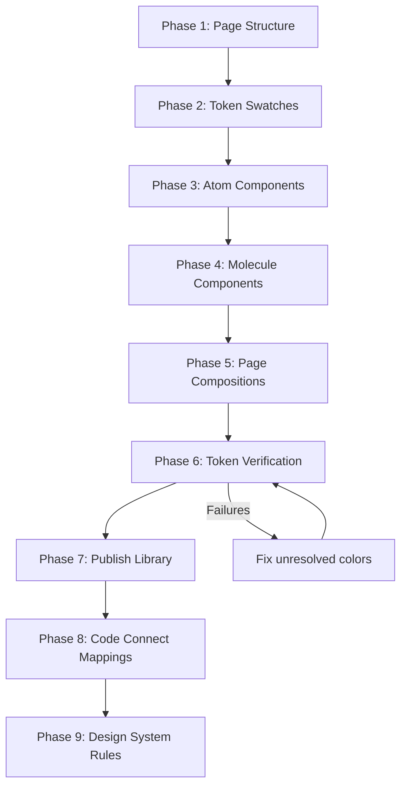

# Design Document: Figma Design System Sync

## Overview

This design describes how to build a complete, organized design system in Figma that mirrors the React codebase's component library. All work is executed via the Figma MCP tools — primarily `use_figma` (which runs JavaScript against the Figma Plugin API) and the Code Connect / design system rules tools.

The core challenge is orchestrating many small Figma Plugin API calls within the 20KB output limit per `use_figma` invocation. The design breaks work into incremental, idempotent operations organized around the component hierarchy: Tokens → Atoms → Molecules → Pages → Code Connect → Rules.

### Key Constraints

- **20KB output limit** per `use_figma` call — no single call can create an entire complex component
- **No image support** — use placeholder rectangles for images/icons; Lucide icons approximated with text labels
- **No custom fonts** — Inter is available as fallback for Geist
- **Code Connect requires published library** — components must be published to a team library before Code Connect mappings can be sent
- **19 existing color tokens** — Light/Dark mode variable collections already exist

### Design Decisions

1. **One component per `use_figma` call** — keeps output well under 20KB and makes failures isolated
2. **Idempotent operations** — each call checks for existing nodes before creating, enabling safe re-runs
3. **Token-first approach** — all color fills reference variable IDs, never hardcoded hex values
4. **Atomic Design taxonomy** — pages named Tokens/Atoms/Molecules/Pages match the codebase's component hierarchy

## Architecture

The sync process follows a sequential pipeline with verification gates between phases:



### Phase Breakdown

**Phase 1 — Page Structure**: Create 4 Figma pages (Tokens, Atoms, Molecules, Pages). Single `use_figma` call.

**Phase 2 — Token Swatches**: On the Tokens page, render all 19 color variables as labeled swatches in Light and Dark mode frames. 1–2 `use_figma` calls.

**Phase 3 — Atom Components**: Create component sets for Button, Badge, Input, Avatar, Separator, Skeleton, Tooltip. Each component is a separate `use_figma` call. Large components (Button with 48 variants) are split across multiple calls.

**Phase 4 — Molecule Components**: Create Card, StatCard, Table, Tabs, RecentActivity component sets. Each is a separate call, composing from atom instances.

**Phase 5 — Page Compositions**: Create StatsPanel, DataPanel, DashboardPage frames. Each frame is a separate call. DashboardPage is split into sub-sections (header, content area) across 2–3 calls.

**Phase 6 — Token Verification**: Use `get_design_context` to audit all components for hardcoded hex values. Flag and fix any unresolved colors.

**Phase 7 — Publish Library**: Prompt user to publish components to team library (manual step required before Code Connect).

**Phase 8 — Code Connect Mappings**: Use `get_code_connect_suggestions` then `send_code_connect_mappings` / `add_code_connect_map` for each component.

**Phase 9 — Design System Rules**: Single `create_design_system_rules` call with the full rules document.

## Components and Interfaces

### Figma MCP Tool Usage Patterns

Each tool serves a specific role in the pipeline:

| Tool | Purpose | Phase |
|------|---------|-------|
| `use_figma` | Create/modify Figma nodes via Plugin API JS | 1–5 |
| `get_design_context` | Read current file state, verify token bindings | 6 |
| `get_screenshot` | Visual verification of created components | 3–5 |
| `get_code_connect_suggestions` | Get suggested mappings for components | 8 |
| `send_code_connect_mappings` | Batch-send Code Connect maps | 8 |
| `add_code_connect_map` | Add individual Code Connect mapping | 8 |
| `create_design_system_rules` | Author design system rules document | 9 |
| `search_design_system` | Find existing components/tokens | 3–6 |

### Component Creation Pattern (use_figma)

Every `use_figma` call follows this pattern:

```javascript
// 1. Find or create the target page
const page = figma.root.children.find(p => p.name === "Atoms")
  || figma.createPage();
if (!page.name) page.name = "Atoms";
figma.currentPage = page;

// 2. Check if component already exists (idempotent)
const existing = page.findOne(n => n.name === "Button" && n.type === "COMPONENT_SET");
if (existing) { /* update or skip */ }

// 3. Look up design token variables
const collections = figma.variables.getLocalVariableCollections();
const colorCollection = collections.find(c => c.name.includes("Color") || c.modes.length >= 2);
const variables = colorCollection.variableIds.map(id => figma.variables.getVariableById(id));

// 4. Create component with token-bound fills
const comp = figma.createComponent();
comp.name = "Button";
const primaryVar = variables.find(v => v.name.includes("primary"));
const fill = figma.variables.setBoundVariableForPaint(
  comp.fills[0], 'color', primaryVar
);
comp.fills = [fill];

// 5. Set auto layout matching Tailwind spacing
comp.layoutMode = "HORIZONTAL";
comp.itemSpacing = 8;  // gap-2
comp.paddingLeft = comp.paddingRight = 10; // px-2.5
```

### Component Inventory

#### Atoms (7 components, ~10 `use_figma` calls)

| Component | Variants | Sizes/States | Estimated Calls |
|-----------|----------|-------------|-----------------|
| Button | 6 (default, outline, secondary, ghost, destructive, link) | 8 (default, xs, sm, lg, icon, icon-xs, icon-sm, icon-lg) | 3 (split by size groups) |
| Badge | 6 (default, secondary, destructive, outline, ghost, link) | — | 1 |
| Input | 4 states (default, focus, disabled, invalid) | — | 1 |
| Avatar | — | 3 (default, sm, lg) + sub-components | 1 |
| Separator | 2 orientations (horizontal, vertical) | — | 1 |
| Skeleton | 3 shapes (line, circle, block) | — | 1 |
| Tooltip | 4 placements (top, bottom, left, right) | — | 1 |

#### Molecules (5 components, ~6 `use_figma` calls)

| Component | Variants | Sub-components | Estimated Calls |
|-----------|----------|---------------|-----------------|
| Card | 2 sizes (default, sm) | CardHeader, CardTitle, CardDescription, CardAction, CardContent, CardFooter | 1 |
| StatCard | 3 trends (up, down, neutral) | Uses Card + Badge + icon | 1 |
| Table | — | TableHeader, TableBody, TableRow, TableHead, TableCell, TableFooter, TableCaption | 2 (structure + example data) |
| Tabs | 2 list variants × 2 orientations | TabsList, TabsTrigger, TabsContent | 1 |
| RecentActivity | — | Uses Avatar + text layers | 1 |

#### Page Compositions (3 frames, ~5 `use_figma` calls)

| Frame | Content | Estimated Calls |
|-------|---------|-----------------|
| StatsPanel | 4×StatCard grid + Overview Card with chart placeholder | 1 |
| DataPanel | Transactions table card + Recent Activity card | 1 |
| DashboardPage (Light) | Header + title row + Tabs + StatsPanel + DataPanel | 2–3 |
| DashboardPage (Dark) | Same as Light, dark mode tokens | 1 |

### Chunking Strategy for 20KB Limit

The 20KB limit applies to the **output** of each `use_figma` call. Strategies:

1. **Minimize output**: Return only essential confirmation data (node IDs, names), not full node trees
2. **One component set per call**: Each call creates one component set with all its variants
3. **Split large variant matrices**: Button has 6×8=48 potential combinations. Create a representative subset:
   - Call 1: All 6 variants at `default` size
   - Call 2: `default` variant at all 8 sizes
   - Call 3: Key cross-combinations (e.g., destructive+sm, outline+lg)
4. **Compose incrementally**: Page compositions reference existing component instances rather than recreating atoms inline

### Tailwind-to-Figma Spacing Map

| Tailwind Class | Figma Value (px) | Usage |
|---------------|-----------------|-------|
| `gap-1` | 4 | Tight spacing |
| `gap-2` | 8 | Button internal gap |
| `gap-3` | 12 | Activity item gap |
| `gap-4` | 16 | Card gap, grid gap |
| `gap-6` | 24 | Section gap |
| `p-2` | 8 | Small padding |
| `p-4` / `px-4` | 16 | Card content padding |
| `p-6` / `px-6` | 24 | Page padding |
| `h-6` | 24 | xs button, sm avatar |
| `h-7` | 28 | sm button |
| `h-8` | 32 | default button, input, default avatar |
| `h-9` | 36 | lg button |
| `h-10` | 40 | lg avatar |
| `h-14` | 56 | Header bar |

### Tailwind-to-Figma Border Radius Map

| Tailwind Class | CSS Value | Figma cornerRadius |
|---------------|-----------|-------------------|
| `rounded-md` | `calc(0.625rem * 0.8)` = 8px | 8 |
| `rounded-lg` | `0.625rem` = 10px | 10 |
| `rounded-xl` | `calc(0.625rem * 1.4)` = ~14px | 14 |
| `rounded-full` | 9999px | 9999 |

## Data Models

### Design Token Variable Structure

The 19 existing color tokens map to CSS custom properties defined in `src/index.css`. Each token has Light and Dark mode values in OKLCH color space.

```
Token Name          | Light (OKLCH)              | Dark (OKLCH)
--------------------|----------------------------|----------------------------
background          | oklch(1 0 0)               | oklch(0.145 0 0)
foreground          | oklch(0.145 0 0)           | oklch(0.985 0 0)
card                | oklch(1 0 0)               | oklch(0.205 0 0)
card-foreground     | oklch(0.145 0 0)           | oklch(0.985 0 0)
popover             | oklch(1 0 0)               | oklch(0.205 0 0)
popover-foreground  | oklch(0.145 0 0)           | oklch(0.985 0 0)
primary             | oklch(0.205 0 0)           | oklch(0.922 0 0)
primary-foreground  | oklch(0.985 0 0)           | oklch(0.205 0 0)
secondary           | oklch(0.97 0 0)            | oklch(0.269 0 0)
secondary-foreground| oklch(0.205 0 0)           | oklch(0.985 0 0)
muted               | oklch(0.97 0 0)            | oklch(0.269 0 0)
muted-foreground    | oklch(0.556 0 0)           | oklch(0.708 0 0)
accent              | oklch(0.97 0 0)            | oklch(0.269 0 0)
accent-foreground   | oklch(0.205 0 0)           | oklch(0.985 0 0)
destructive         | oklch(0.577 0.245 27.325)  | oklch(0.704 0.191 22.216)
border              | oklch(0.922 0 0)           | oklch(1 0 0 / 10%)
input               | oklch(0.922 0 0)           | oklch(1 0 0 / 15%)
ring                | oklch(0.708 0 0)           | oklch(0.556 0 0)
chart-1 through 5   | (grayscale ramp)           | (same grayscale ramp)
```

### Code Connect Mapping Structure

Each mapping links a Figma component node to its React source:

```typescript
interface CodeConnectMap {
  figmaNodeId: string;          // Figma node ID of the component or variant
  componentPath: string;        // e.g., "src/components/ui/button.tsx"
  componentName: string;        // e.g., "Button"
  props: Record<string, {
    figmaProperty: string;      // Figma variant property name
    values: Record<string, string>; // Figma value → React prop value
  }>;
}
```

Example for Button:
```json
{
  "figmaNodeId": "<node-id>",
  "componentPath": "src/components/ui/button.tsx",
  "componentName": "Button",
  "props": {
    "variant": {
      "figmaProperty": "Variant",
      "values": {
        "Default": "default",
        "Outline": "outline",
        "Secondary": "secondary",
        "Ghost": "ghost",
        "Destructive": "destructive",
        "Link": "link"
      }
    },
    "size": {
      "figmaProperty": "Size",
      "values": {
        "Default": "default",
        "XS": "xs",
        "SM": "sm",
        "LG": "lg",
        "Icon": "icon",
        "Icon XS": "icon-xs",
        "Icon SM": "icon-sm",
        "Icon LG": "icon-lg"
      }
    }
  }
}
```

### Design System Rules Structure

The rules document passed to `create_design_system_rules`:

```json
{
  "spacing": {
    "baseUnit": 4,
    "scale": {
      "1": 4, "2": 8, "3": 12, "4": 16, "5": 20, "6": 24, "8": 32
    },
    "componentGap": 16,
    "sectionGap": 24,
    "cardPadding": 16,
    "pagePadding": 24
  },
  "typography": {
    "fontFamily": "Inter",
    "scale": {
      "xs": { "size": 12, "lineHeight": 16 },
      "sm": { "size": 14, "lineHeight": 20 },
      "base": { "size": 16, "lineHeight": 24 },
      "lg": { "size": 18, "lineHeight": 28 },
      "xl": { "size": 20, "lineHeight": 28 },
      "3xl": { "size": 30, "lineHeight": 36 }
    },
    "cardTitle": { "size": 16, "weight": 500, "font": "heading" },
    "pageTitle": { "size": 30, "weight": 700, "font": "heading" }
  },
  "borderRadius": {
    "button": 10,
    "input": 10,
    "card": 14,
    "badge": 9999
  },
  "elevation": {
    "card": "ring-1 ring-foreground/10",
    "popover": "shadow-md ring-1 ring-foreground/10"
  },
  "composition": {
    "hierarchy": ["Atoms", "Molecules", "Pages"],
    "rule": "Atoms compose into Molecules, Molecules compose into Page compositions. Never skip levels."
  },
  "color": {
    "rule": "All color values MUST reference design token variables. No hardcoded hex values.",
    "tokenCollection": "existing 19-token Light/Dark collection"
  }
}
```

## Error Handling

### `use_figma` Call Failures

- **Output exceeds 20KB**: Split the operation into smaller chunks. Reduce the number of variants created per call.
- **Node not found**: The idempotent pattern checks for existing nodes first. If a referenced component doesn't exist yet, the call should create it or report the dependency.
- **Variable not found**: If a design token variable can't be resolved by name, fall back to searching by partial name match. If still not found, flag the color for user resolution (Requirement 9.4).

### Code Connect Failures

- **Components not published**: `send_code_connect_mappings` will fail if the library isn't published. The workflow gates on user confirmation of library publication before attempting Code Connect.
- **Mapping rejected**: If a mapping is rejected, log the specific error and retry with corrected node IDs. Use `get_code_connect_suggestions` to get the correct node references.

### Token Verification Failures

- **Hardcoded hex found**: When `get_design_context` reveals a hardcoded color that has a matching token, automatically fix it by re-binding to the variable. If no matching token exists, prompt the user to create one or map to an existing token.
- **Mode switch verification**: After switching to Dark mode, compare actual fill values against expected Dark mode token values. Report any mismatches.

## Testing Strategy

### Why Property-Based Testing Does Not Apply

This feature consists entirely of:
- **Side-effect-only operations** — creating Figma nodes, pushing Code Connect mappings, authoring rules
- **External service interaction** — all operations go through the Figma MCP/Plugin API
- **Configuration and setup** — page structure, design system rules are one-time setup

There are no pure functions, parsers, serializers, or data transformations in our code to test with PBT. The "code" is a sequence of Figma Plugin API calls orchestrated through MCP tools.

### Verification Approach

Instead of automated tests, verification uses the Figma MCP tools themselves:

1. **Visual verification** (`get_screenshot`): After each component creation phase, capture screenshots to confirm visual accuracy against the React components.

2. **Structural verification** (`get_design_context`): After each phase, read back the file structure to confirm:
   - Correct page names exist
   - Expected component sets are on the right pages
   - Variant properties match the code's variant definitions
   - Auto layout values match Tailwind spacing

3. **Token binding verification** (`get_design_context`): Scan all components for:
   - No hardcoded hex fills where a token exists
   - All fills/strokes/text colors bound to variable IDs
   - Dark mode switch produces correct color changes

4. **Code Connect verification** (`send_code_connect_mappings` response): Confirm all mappings accepted without errors.

5. **Rules verification** (`create_design_system_rules` response): Confirm rules saved successfully.

### Verification Checklist Per Phase

| Phase | Verification Method | Pass Criteria |
|-------|-------------------|---------------|
| Page Structure | `get_design_context` | 4 pages exist with correct names |
| Token Swatches | `get_screenshot` of Tokens page | 19 swatches visible in Light + Dark |
| Each Atom | `get_screenshot` + `get_design_context` | Correct variants, token-bound colors |
| Each Molecule | `get_screenshot` + `get_design_context` | Correct sub-components, spacing |
| Page Compositions | `get_screenshot` | Layout matches React implementation |
| Token Coverage | `get_design_context` scan | Zero hardcoded hex values with matching tokens |
| Code Connect | `send_code_connect_mappings` response | All mappings accepted |
| Design Rules | `create_design_system_rules` response | Rules saved confirmation |
